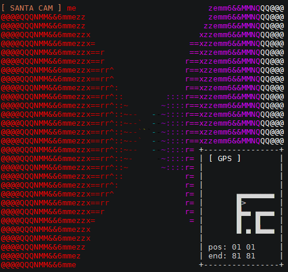
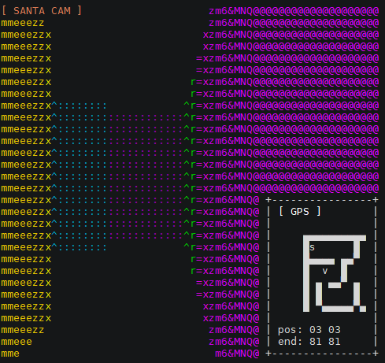
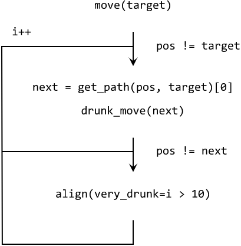
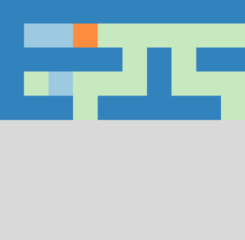
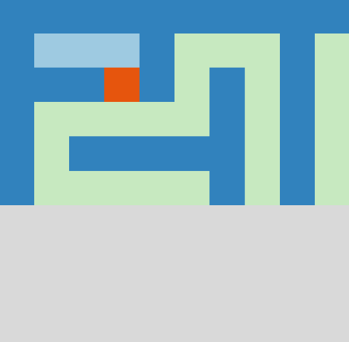

| :christmas_tree: **Find the original write-up [in our blog](https://www.sigflag.at/blog/2019/writeup-otw-lost-in-maze/)** |
|--------------|

# "Lost in Maze" Day 25 from OverTheWire Advent Bonanza 2019

The last day of the [OverTheWire Advent Bonanza 2019](https://advent2019.overthewire.org/) was a coding challenge where you should find your way out of a maze.

## Challenge Overview

Connecting to `nc 3.93.128.89 1225` prompted you with a 3D view of a maze where you stand at position `(1, 1)` and should move to `(81, 81)`.

You can move your character with the WASD keys

- `wwww` moves your character 1 cell forward
- `ddddddd` turns your character (almost) 90 degrees to the right

Unfortunately, the moves aren't very accurate. Thus, your character ends up being a bit off-center from time to time. This is tricky for programmatic maze traversal.

## Stable Move Function

First, we need a function `move(target)` that reliably moves our character to some target position. This function loops through the following actions until we reach the target:

1. Search for the shortest path to the target position (with [breadth-first search](https://en.wikipedia.org/wiki/Breadth-first_search)) and move to the first cell on that path with `drunk_move(next)`. The drunk moving function attempts a move to an adjacent cell, using the keystrokes from above.
2. If we didn't reach our `next` position we weren't aligned parallel to the axis system and need to call our `align()` function (explained below).
3. Check if `pos == target`, otherwise start over with step 1. If it seems that we can't reach the target (i.e., if we are looping more than 10 times already), we set the `very_drunk` flag on the `align()` function, which will add some more aggressive (random) moves to get free.

The `align()` function tries to align us parallel to the axis system. To decide whether we should turn right or left, we count the number of pixels in the left and right half of the 3D view. If there are more pixels in the right half, we are most likely staring at a wall to our right and need to turn left.

The `align()` function also has a very-drunk mode, which will be enabled if we are stuck at the same position for too long. If enabled, it chooses the turn intensity at random (instead of fixed slight turns only). This helps to break loops if the pixel-count strategy gets stuck.

## Escaping the Maze

To reach the goal we combined the following three strategies:

- Efficiently explore the maze with [Trémaux's algorithm](https://en.wikipedia.org/wiki/Maze_solving_algorithm#Tr%C3%A9maux's_algorithm), which is a method that will traverse the entire maze until some target condition is satisfied.
- Close off the entrances to dead-ends if they become visible on the map.
- As soon as a path to the goal is possible, directly move there with [breadth-first search](https://en.wikipedia.org/wiki/Breadth-first_search).

Initially, we have incomplete information about the maze because we always only see a small area around us. Thus, we need a strategy that can just explore the maze without making unnecessary moves. We choose [Trémaux's algorithm](https://en.wikipedia.org/wiki/Maze_solving_algorithm#Tr%C3%A9maux's_algorithm) because its simple, effective, and guaranteed to work for all kinds of mazes.

When Trémaux's algorithm encounters a new intersection it usually chooses some path at random. Since we know our goal coordinates we instead choose the path that lies closest to that as a slight optimization.

Trémaux's algorithm assumes being in the maze without a way to see paths from above. However, since we see a small region around us at all time, we should avoid exploring dead-ends if we clearly see them.

Thus, we use the [dead-end filling algorithm](https://en.wikipedia.org/wiki/Maze_solving_algorithm#Dead-end_filling), which traverses dead-ends back to the next intersection and closes the entrance to them.

The animation above nicely shows our strategy in action. Walls are blue, where light blue indicates virtual walls that were placed there by our dead-end filling algorithm.

You can see that the algorithm backtracks from a dead-end as soon as we spot it on the map. If our character is inside the dead-end, we obviously don't close the entrance but we place a virtual wall right in front of us instead.

## Final Solution

[This video](doc/maze_solution.mp4) (or the animation below) shows one full pass from start to goal. This strategy solved the maze reliably in almost all scenarios. Rarely, if the algorithm has to backtrack too much we sometimes ran into a server timeout.

The flag was printed to the terminal once we reached the target. Actually, our code crashes at that point because it would have expected a 3D view of the maze. Thus, we exfiltrated that string from a Wireshark dump instead of changing the parser ;)

    .[1mYou saved Christmas, here is your reward:.[0m
    AOTW{426573742077697368657320666F7220323032302121}

If you are interested, you can peek into the source code at [github.com/blu3r4y/overthewire-advent2019-lost-in-maze](https://github.com/blu3r4y/overthewire-advent2019-lost-in-maze) - just move to the `src` folder and execute `python -m otw25.solve` to test it out for yourself. Happy Holidays! :)
